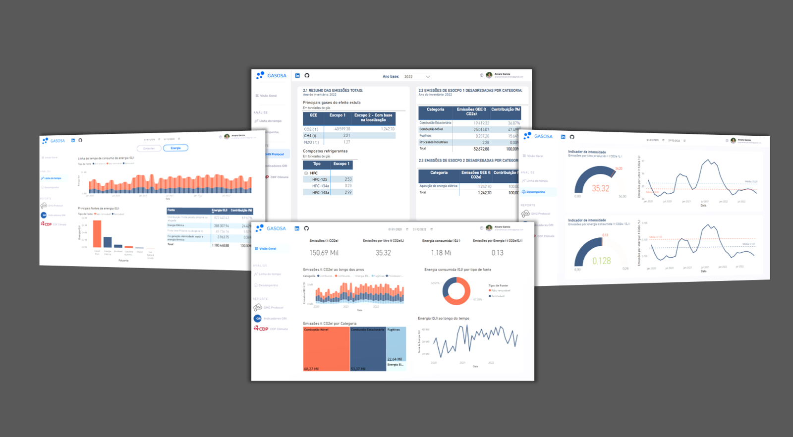
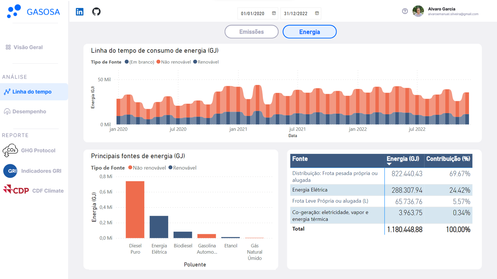
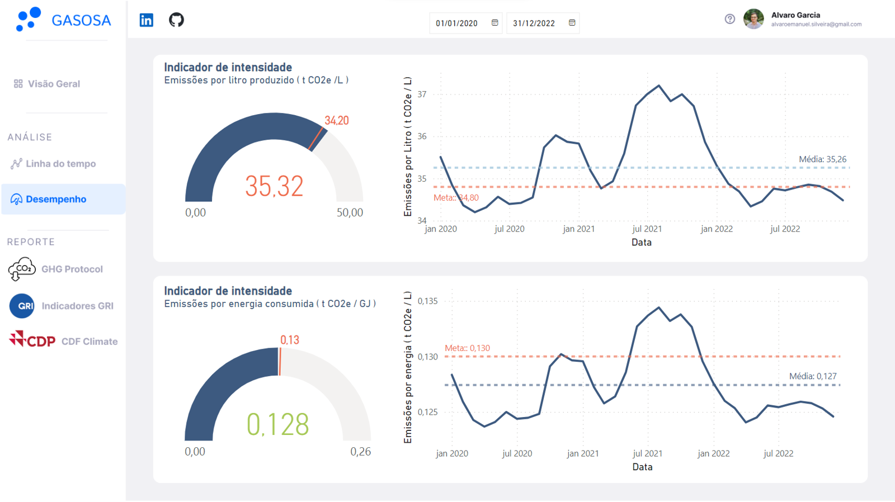
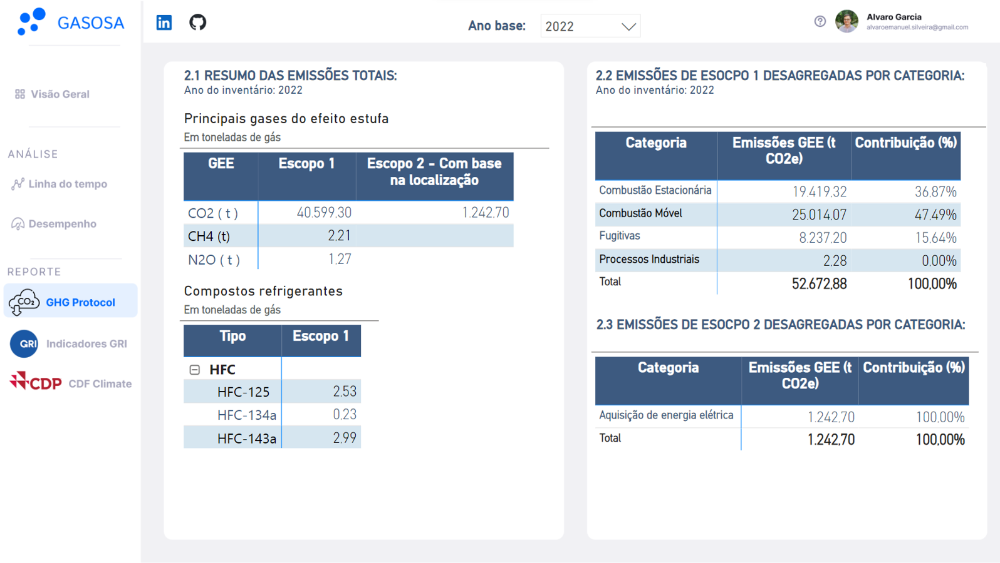

# Power BI Portfólio de Projetos

Bem-vindo ao meu portfólio pessoal do Power BI ! Nesse espaço você vai encontrar uma coleção de projetos construídos no Power BI, incluindo visualizações de dados e dashboards. Esses projetos apresentam soluções no tratamento, modelagem e visualização de dados, além de aplicações práticas e ferramentas de inteligência de negócios.

## Sobre mim
Me chamo Alvaro Silveira, e atuo hoje como analista de meio ambiente, mas ao longo de minha carreira e estudo, a análise de dados e construção de ferramentas de negócios se mostrou essencial. Desenvolvi no trabalho ferramentas para a análise de dados ambientais, monitoramento de indicadores chaves e cálculo de indicadores ambientais. 

## Projetos

### [Projeto 1: Ferramenta para o cálculo do inventário de emissões e indicadores de sustentabilidade](https://app.powerbi.com/view?r=eyJrIjoiZmQzOWQ0NDUtYTVhMi00OTczLWFmY2ItMDQ4ZWE4YzVhYTU3IiwidCI6IjY0MTg4ZWMwLTc1MGItNDI1OS04M2U1LWNkYTFmNWIzMDg3MCJ9)

A atual preocupação com as mudanças climáticas tem influenciado na busca de soluções que permitam cálcular, analisar e interpretar as emissões de gases do efeito estufa (GEE) de um negócio. A ferramenta a seguir foi construída no Power BI com esse objetivo. Através de um estudo de caso na indústria de bebidas, os dados de consumo de insumos industriais de fontes de gases GEE são modelados para estimar as emissões da companhia e calcular os indicadores de sustentabilidade associados.
.
#### Preview

#### Visão Geral

Na tela principal da ferramenta é possível acompanhar as emissões da companhia Gasosa que produz bebidas gaseificadas. Além das emissões, também temos a energia consumida em Gigajoules e indicadores de intensidade importante para a organização. Esses elementos são importantes na construção de indicadores e reportes de sustentabilidade.

#### Linha do tempo e desempenho

Dentro da aba de linha do tempo, é possível compreender em maiores detalhes a evolução das emissões e consumo de energia da companhia Gasosa. As visualizações permitem também entender os principais componentes relacionados a esses indicadores, como as fontes de emissões e combsutíveis consumidos. 

#### GHG PROTOCOL

Um dos aspectos relacionado a gestão ESG é a transparência, e os diferentes reportes de sustentabilidade visam justamente alcançar esse objetivos. A aba do GHG Protocol apresenta um resumo das informações de emissões da organização necessárias para o preenchimento do sistema do Programa Brasileiro do GHG Protocol da FGV, simplificando o preenchimento por parte da empresa.

Esse projeto ainda se encontra em construção, os próximos passos envolvem a construção das abas relacionadas ao reporte dos indicadores de GRI associados a emissões e energia e do CDP Climate. Além disso, serão criadas abas específicas no detalhamento dos insumos mensais e uma aba bsucando facilitar a auditoria das informações existentes.

## Informações de contato

## Autor
- [<ins><b>©2023 Alvaro Silveira. All rights reserved</b></ins>](https://alvarogarcia.netlify.app/about)
- [LinkedIn](https://www.linkedin.com/in/alvaro-silveira-62a770176/)

  
## Licença
Por conta do tempo e conhecimento investido nesses projetos, parte dos arquivos PBIX não estão disponíveis publicamente no GITHUB. Caso tenha interesse em um dos projetos ou deseje trocar informações sobre como eles foram construídos, não hesite em entrar em contato. Obrigado !
