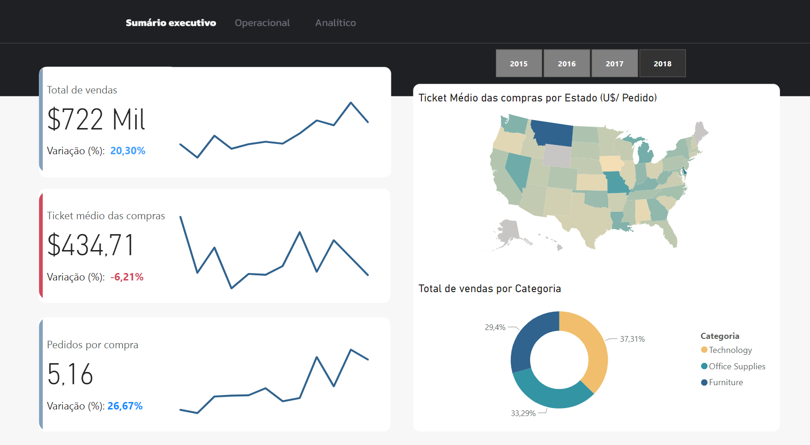
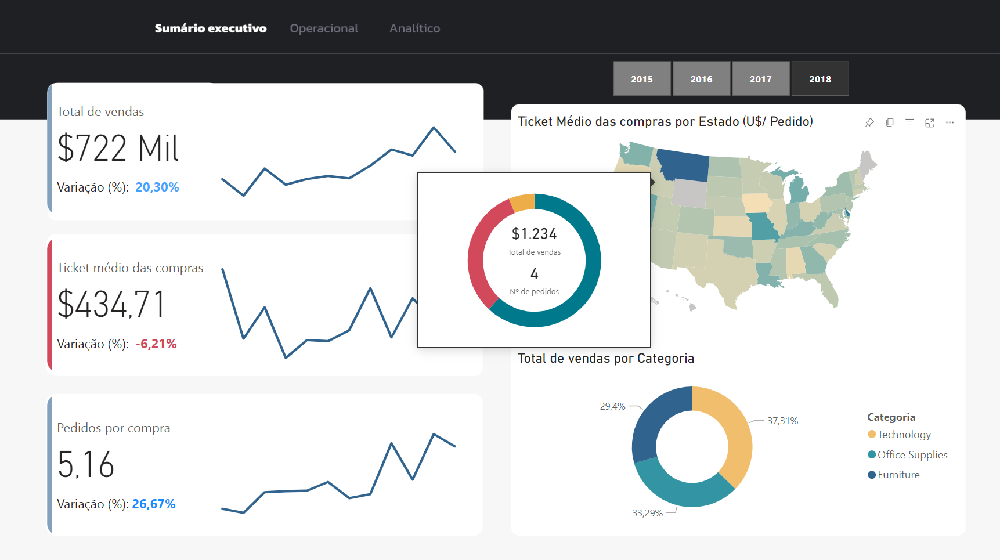
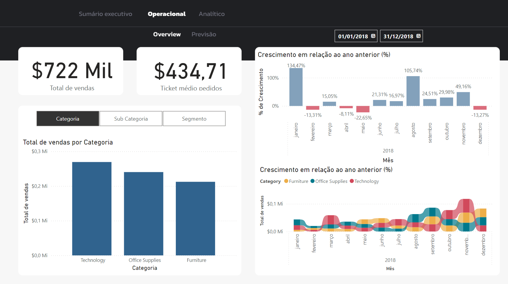
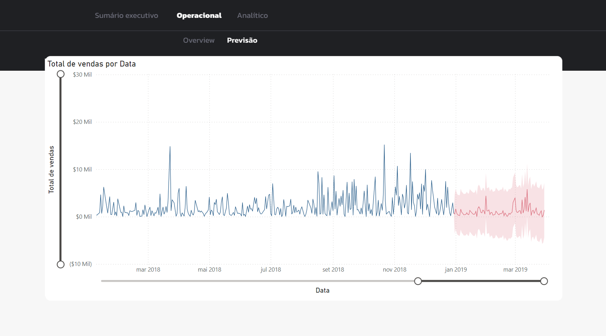
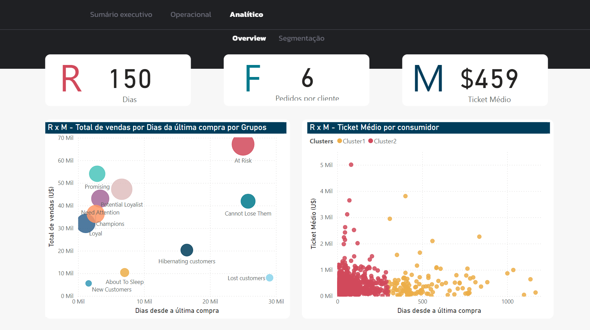
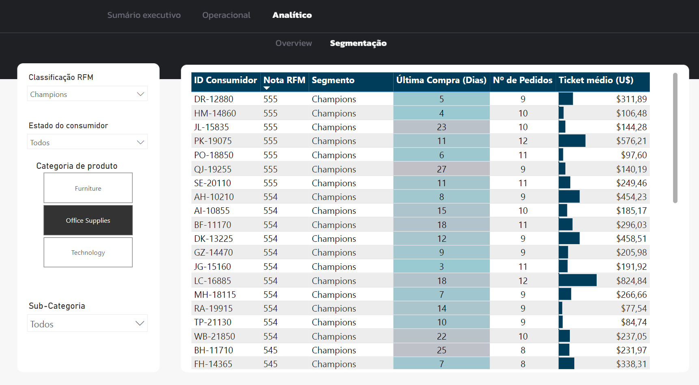

# Power BI Project Portfolio

## Welcome to my personal Power BI portfolio!
In this space, you will find a collection of projects built in Power BI, including data visualizations and dashboards. These projects present solutions in data treatment, modeling, and visualization, as well as practical applications and business intelligence tools.

## About Me
My name is Alvaro Silveira, and I currently work as an environmental analyst, but throughout my career and studies, data analysis and business tool building have proven essential. I have developed tools for environmental data analysis, monitoring key indicators, and calculating environmental indicators.

## Projects
**[Projeto 1 - Emissions and sustainability tool](https://github.com/alv-garcia/PowerBI_Portfolio/tree/main?tab=readme-ov-file#visao-geral)** 
**[Projeto 2 - Superstores Sales - RFM Analysis](https://github.com/alv-garcia/PowerBI_Portfolio?tab=readme-ov-file#projeto-3-superstore-sales---an%C3%A1lise-rfm)** 

## [Project 1: Emissions Inventory and Sustainability Indicators Tool](https://app.powerbi.com/view?r=eyJrIjoiZmQzOWQ0NDUtYTVhMi00OTczLWFmY2ItMDQ4ZWE4YzVhYTU3IiwidCI6IjY0MTg4ZWMwLTc1MGItNDI1OS04M2U1LWNkYTFmNWIzMDg3MCJ9)

### Power BI Dashboard for Greenhouse Gas Emissions Calculation and Analysis in the Beverage Industry
#### Introduction

The growing concern over climate change has driven organizations to seek solutions for calculating, analyzing, and interpreting their greenhouse gas (GHG) emissions. This Power BI dashboard addresses this need by providing a comprehensive tool for businesses in the beverage industry to track, measure, and report their GHG emissions.

#### Case Study: Gasosa Beverage Company

The dashboard utilizes a case study of Gasosa, a beverage company, to demonstrate its capabilities. The tool models data on the company's industrial input consumption from GHG emission sources to estimate its emissions and calculate associated sustainability indicators.

**An interactive version of the dashboard can be accessed by clicking on the project title.**

#### Preview

#### Overview

The dashboard's main screen provides an overview of Gasosa's emissions, energy consumption in gigajoules, and key intensity indicators. These elements are crucial for building sustainability indicators and reports

#### Timeline and Performance

The timeline tab delves into the evolution of Gasosa's emissions and energy consumption. It allows users to understand the key components influencing these indicators, such as emission sources and consumed fuels.

#### GHG PROTOCOL

Transparency is a crucial aspect of ESG management, and sustainability reports aim to achieve this objective.expand_more The GHG Protocol tab presents a summary of the organization's emission information required for the GHG Protocol Brazilian Program system of FGV, simplifying the company's reporting process.

#### Future Enhancements

The project is still under development, with the following enhancements planned:

- GRI and CDP Climate Reporting: Dedicated tabs for GRI and CDP Climate emission and energy indicator reporting.
- Monthly Input Detailing: Specific tabs for detailed monthly input breakdown.
- Information Audit Facilitation: A tab designed to facilitate the auditing of existing information.

## [Projeto 2 - Superstores Sales - RFM Analysis](https://app.powerbi.com/view?r=eyJrIjoiYmRlMmJjNGEtMTVjZC00MjYyLThkYTktOTk2NmFhZTQ0Y2UxIiwidCI6IjY0MTg4ZWMwLTc1MGItNDI1OS04M2U1LWNkYTFmNWIzMDg3MCJ9)

### Power BI Dashboard for Customer Segmentation and Marketing Strategies Using RFM Analysis
#### Introduction

In today's competitive business landscape, understanding and effectively managing customer relationships is crucial for success. This Power BI dashboard utilizes the RFM (Recency, Frequency, Monetary) analysis method to segment customers based on their purchase behavior, enabling businesses to develop targeted marketing strategies and enhance customer loyalty. The dashboard utilizes the [Superstore Sales] (https://www.kaggle.com/datasets/bhanupratapbiswas/superstore-sales) dataset from Kaggle, a comprehensive dataset containing sales transactions for a fictitious retail company.

Through RFM analysis, the tool segments customers based on three key criteria: Recency (last purchase), Frequency (regular purchases) and Monetary Value (average value of purchases). This segmentation allows the creation of personalized strategies for each group of customers, optimizing marketing and loyalty actions, and boosting the company's profitability.

This executive summary provides a comprehensive overview of sales performance and key business indicators. The insights and recommendations presented serve as a valuable guide for the company's leadership team to make informed strategic decisions that drive sustainable growth and profitability.

The operational section of the dashboard provides a granular view of sales performance across product categories and over time. This detailed analysis enables managers to:

- Identify trends and patterns: Track sales trends by category and period to identify areas of growth, decline, or stagnation.
- Pinpoint performance outliers: Uncover sudden spikes or dips in sales to investigate underlying causes and implement corrective actions.
- Analyze seasonal patterns: Understand the impact of seasonality on sales performance to optimize marketing and sales strategies.

This tool allows you to identify consumers who are most likely to respond to a new offer, consumers who need more attention, loyal customers, and customers who have just made a purchase and should be nurtured.

The RFM method, a customer segmentation technique based on Recency, Frequency, and Monetary Value, empowers businesses to craft targeted strategies that enhance campaign effectiveness and drive customer engagement. By analyzing these three key factors, businesses can gain valuable insights into customer behavior and tailor their marketing efforts accordingly.

1. Recency: Understanding Purchase Patterns

Recency measures the time elapsed since a customer's last purchase. This metric is crucial for identifying customers who have made recent purchases and those who have become inactive. By understanding recency patterns, businesses can prioritize re-engagement campaigns for lapsed customers and nurture relationships with recently acquired ones.

2. Frequency: Uncovering Purchase Habits

Frequency gauges the regularity of a customer's purchases. This metric helps businesses identify loyal, high-frequency customers and those who make infrequent purchases. By analyzing frequency patterns, businesses can implement loyalty programs to reward repeat customers and targeted promotions to encourage more frequent purchases from less engaged ones.

3. Monetary Value: Assessing Customer Lifetime Value

Monetary Value measures the average amount a customer spends per transaction. This metric is essential for identifying high-value customers and those who make smaller purchases. By understanding monetary value patterns, businesses can focus their marketing efforts on high-value customers and implement strategies to increase the average order value of less valuable customers.

Leveraging RFM for Strategic Segmentation

By combining these three factors into a single RFM score, businesses can segment their customer base into distinct groups with shared characteristics. This segmentation enables businesses to develop targeted marketing campaigns that resonate with each segment, maximizing campaign effectiveness and return on investment.

## Contact Information

## Author
- [<ins><b>©2023 Alvaro Silveira. All rights reserved</b></ins>](https://alvarogarcia.netlify.app/about)
- [LinkedIn](https://www.linkedin.com/in/alvaro-silveira-62a770176/)

## License
Due to the time and knowledge invested in these projects, some of the PBIX files are not publicly available on GITHUB. If you are interested in one of the projects or would like to exchange information on how they were built, please do not hesitate to contact me. Thank you!
